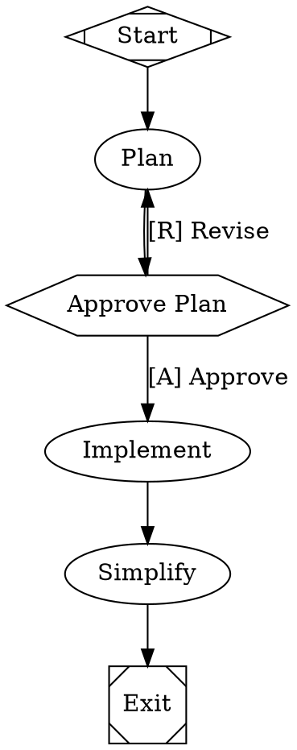

<div align="left" id="top">
<a href="https://docs.fabro.sh"></a>
</div>

## The open source dark software factory for expert engineers

> *Agents run the graph*
> *You review only what matters*
> *Ship with confidence*

AI coding agents are powerful but unpredictable. You either babysit every step or review a 50-file diff you don't trust. Fabro gives you a middle path: define the process as a graph, let agents execute it, and intervene only where it matters. [Why Fabro?](https://docs.fabro.sh/getting-started/why-fabro)

[](https://github.com/fabro-sh/fabro/actions/workflows/rust.yml)
[](LICENSE.md)
[](https://docs.fabro.sh)


```bash
# With Claude Code
curl -fsSL https://fabro.sh/install.md | claude

# With Codex
codex "$(curl -fsSL https://fabro.sh/install.md)"

# With Homebrew
brew install fabro-sh/tap/fabro-nightly

# With Bash
curl -fsSL https://fabro.sh/install.sh | bash
```

Then run `fabro server start` to finish setup in your browser. The server opens a web wizard, exits when the wizard completes, and starts in configured mode the next time you run it.


---

## Use Cases

- **Extend disengagement time** — Stop babysitting an agent REPL. Define a workflow with verification gates and walk away — Fabro keeps the process on track without you.
- **Leverage ensemble intelligence** — Seamlessly combine models from different vendors. Use one model to implement, another to cross-critique, and a third to summarize — all in a single workflow.
- **Share best practices across your team** — Collaborate on version-controlled workflows that encode your software processes as code. Review, iterate, and reuse them like any other source file.
- **Reduce token bills** — Route cheap tasks to fast, inexpensive models and reserve frontier models for the steps that need them. CSS-like stylesheets make this a one-line change.
- **Improve agent security** — Run agents in cloud sandboxes with full network and filesystem isolation. Keep untrusted code off your laptop and out of your production environment.
- **Run agents 24/7** — Fabro's API server queues and executes runs continuously. Close your laptop — workflows keep running and results are waiting when you return.
- **Scale infinitely** — Move execution off your laptop and into cloud sandboxes. Run as many concurrent workflows as your infrastructure allows.
- **Guarantee code quality** — Layer deterministic verifications — test suites, linters, type checkers, LLM-as-judge — into your workflow graph. Failures trigger fix loops automatically.
- **Achieve compounding engineering** — Automatic retrospectives after every run feed a continuous improvement loop. Your workflows get better over time, not just your code.
- **Specify in natural language** — Define requirements as natural-language specs and let Fabro generate — and regenerate — implementations that conform to them.

---

## Key Features

|     | Feature                        | Description                                                                                           |
| --- | ------------------------------ | ----------------------------------------------------------------------------------------------------- |
| 🔀  | Deterministic workflow graphs  | Define pipelines in Graphviz DOT with branching, loops, parallelism, and human gates. Diffable, reviewable, version-controlled |
| 🙋  | Human-in-the-loop              | Approval gates pause for human decisions. Steer running agents mid-turn. Interview steps collect structured input |
| 🎨  | Multi-model routing            | CSS-like stylesheets route each node to the right model and provider, with automatic fallback chains  |
| ☁️  | Cloud sandboxes                | Run agents in isolated Daytona cloud VMs with snapshot-based setup, network controls, and automatic cleanup |
| 🔌  | SSH access and preview links   | Shell into running sandboxes with `fabro sandbox ssh` and expose ports with `fabro sandbox preview` for live debugging    |
| 🌲  | Git checkpointing              | Every stage commits code changes and execution metadata to Git branches. Resume, revert, or trace any change |
| 📊  | Automatic retros               | Each run generates a retrospective with cost, duration, files touched, and an LLM-written narrative   |
| ⚡  | Comprehensive API              | REST API with SSE event streaming and a React web UI. Run workflows programmatically or as a service  |
| 🦀  | Single binary, no runtime      | One compiled Rust executable with zero dependencies. No Python, no Node, no Docker required           |
| ⚖️  | Open source (MIT)              | Full source code, no vendor lock-in. Self-host, fork, or extend to fit your workflow                  |

---

## Example Workflow

A plan-approve-implement workflow where a human reviews the plan before the agent writes code:




Agents run as multi-turn LLM sessions with tool access. Human gates (`hexagon`) pause for approval. The stylesheet routes planning to a cheap model and coding to a frontier model. See the [Graphviz DOT language reference](https://docs.fabro.sh/reference/dot-language) for the full syntax.

---

## 📖 Documentation

Fabro ships with [comprehensive documentation](https://docs.fabro.sh) covering every feature in depth:

- [**Getting Started**](https://docs.fabro.sh/getting-started/introduction) -- Installation, first workflow, and why Fabro exists
- [**Defining Workflows**](https://docs.fabro.sh/workflows/stages-and-nodes) -- Node types, transitions, variables, stylesheets, and human gates
- [**Executing Workflows**](https://docs.fabro.sh/execution/run-configuration) -- Run configuration, sandboxes, checkpoints, retros, and failure handling
- [**Tutorials**](https://docs.fabro.sh/tutorials/hello-world) -- Step-by-step guides from hello world to parallel multi-model ensembles
- [**API Reference**](https://docs.fabro.sh/api-reference/overview) -- Full OpenAPI spec with authentication, SSE events, and client SDKs

---

## Quick Start

### Install

```bash
# With Claude Code
curl -fsSL https://fabro.sh/install.md | claude

# With Codex
codex "$(curl -fsSL https://fabro.sh/install.md)"

# With Homebrew
brew install fabro-sh/tap/fabro-nightly

# With Bash
curl -fsSL https://fabro.sh/install.sh | bash
```

Release binaries and the multi-arch Docker image ship with SLSA Build Provenance attestations. See [Verifying Releases](https://docs.fabro.sh/reference/verifying-releases) to check an artifact was built by our GitHub Actions workflow.

Then finish setup in your browser and initialize Fabro in your project:

```bash
fabro server start     # opens a web install wizard in your browser
                       # (server exits when the wizard finishes — start it again to run Fabro)

cd my-project
fabro repo init        # per project
```

For headless or scripted environments, `fabro install` runs the same setup as a CLI-only wizard.

---

## Running Fabro

Fabro runs as a server. You choose where it runs:

- **On your laptop** — install the CLI (above) and run `fabro server start`. Workflows pause when your laptop sleeps.
- **On a host (self-hosted)** — deploy the Docker image with `docker compose` or any cloud container service (ECS, Cloud Run, Kubernetes). See [Self-host with Docker](https://docs.fabro.sh/administration/self-host-docker).

One-click managed alternative for the same Docker image:

[](https://railway.com/deploy/UcEy5m?referralCode=E5TucU&utm_medium=integration&utm_source=template&utm_campaign=generic)

See the [deployment overview](https://docs.fabro.sh/administration/deployment) for the full picture.

---

## Contributing to Fabro

Fabro uses an **issue-based contribution model**. Instead of accepting outside pull requests, we accept bug reports and feature requests as GitHub Issues.

AI can rapidly write or edit large amounts of plausible-looking code. Accepting these patches from external sources opens up risks to security and quality. To mitigate these risks, we are tightly controlling the inputs into the software development process.

Contributions follow these steps:

1. **Open an issue** -- File an issue with a bug report or feature request. The more detail your issue contains, the easier it will be for us to address it quickly and successfully.

2. **We build it** -- A Fabro maintainer will follow our software development process to create a patch, supervising AI coding agents and workflows.

3. **You get credit** -- We will include you as a co-author on the commit which lands the change.

As a result, you get the feature you need, without needing to keep a fork in sync.

If you need a capability which is not in-scope for Fabro, you always have the option to maintain a fork of Fabro as it is distributed under the MIT license.

---

## Help or Feedback

- [Bug reports](https://github.com/fabro-sh/fabro/issues) via GitHub Issues
- [Feature requests](https://github.com/fabro-sh/fabro/discussions) via GitHub Discussions
- Email [bryan@qlty.sh](mailto:bryan@qlty.sh) for questions
- See [CONTRIBUTING.md](CONTRIBUTING.md) for build instructions and development workflow

---

## License

Fabro is licensed under the [MIT License](LICENSE.md).