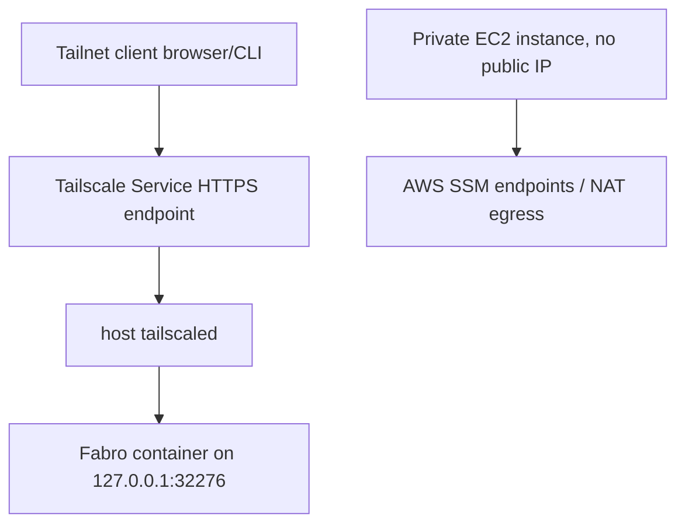

# feat: Support Tailscale Services deployments

## Overview

Add a supported deployment option where Fabro runs on an EC2 instance with no
public IP address, no inbound security group rules, no Caddy, no Let's Encrypt,
and no Route 53 application record. HTTPS access is provided by a Tailscale
Services layer 7 endpoint that proxies to the local Fabro HTTP port.

The existing Caddy-based deployment remains supported. This plan adds a second
deployment profile and makes first-run/install ergonomics work cleanly when the
public origin is a Tailscale Service DNS name.

## Problem Frame

The current `fabro-testing.lithoscomputer.net` deployment is a public EC2
instance with Caddy terminating TLS and Route 53 pointing at the instance public
IPv4 address. That works, but it requires public web ingress, public DNS, and
certificate automation on the host.

For `fabro-testing`, the preferred shape is now:

- EC2 in a private subnet
- no public IPv4 address
- no inbound TCP 22/80/443
- management through AWS Systems Manager Session Manager
- UI/API through Tailscale Services HTTPS
- Fabro itself still serving plain HTTP on port `32276`

This aligns with Fabro's existing server contract: Fabro does not terminate
inbound TLS directly; it expects HTTPS to be terminated by an upstream proxy,
load balancer, platform ingress, or service mesh.

## Requirements Trace

- R1. Preserve the existing Caddy deployment mode and documentation.
- R2. Add a Tailscale Services deployment mode with no Caddy container and no
  Let's Encrypt or Route 53 app record.
- R3. Allow EC2 deployment in a private subnet with no public IP.
- R4. Keep the EC2 security group closed to inbound SSH and web traffic.
- R5. Confirm Session Manager access before disabling/removing SSH.
- R6. Make first-run install URLs and canonical server URLs use the Tailscale
  HTTPS origin.
- R7. Keep GitHub webhooks explicitly separate from Tailscale Services, because
  tailnet-only services are not reachable by GitHub's public webhook delivery.
- R8. Document an operational migration path for `fabro-testing`.

## Scope Boundaries

- In scope:
  - Docker Compose profile/template changes for a Tailscale Services deployment
  - install-mode URL hint improvements
  - self-hosting docs and deployment docs
  - AWS deployment/runbook changes for private subnet, SSM, and no SSH
  - Fabro testing migration plan
- Out of scope:
  - embedding a Tailscale client or tsnet server inside Fabro
  - replacing all existing Caddy deployment guidance
  - exposing public GitHub webhooks through the tailnet-only Service
  - implementing Terraform in this first pass, unless a later implementation
    pass finds existing IaC that should own these resources

## Context & Research

### Relevant Code and Patterns

- `docker-compose.yaml` currently publishes `${FABRO_PORT:-32276}:32276`
  from the Fabro container.
- `docker-compose.prod.yaml` adds `caddy:2-alpine`, host ports 80/443, and
  `docker/Caddyfile`.
- `Dockerfile` runs `fabro server start --foreground --bind
  0.0.0.0:${PORT:-32276}` inside the container.
- `docs/public/administration/self-host-docker.mdx` documents the base Compose
  file and the Caddy TLS overlay.
- `docs/public/administration/server-configuration.mdx` already states that
  Fabro does not terminate inbound TLS and uses `[server.web].url` plus
  `[server.api].url` for external HTTPS URLs.
- `lib/crates/fabro-server/src/canonical_origin.rs` already supports
  `FABRO_WEB_URL` as a runtime override for `server.web.url`.
- `lib/crates/fabro-cli/src/commands/server/mod.rs` install-mode URL hints only
  know Railway public domains and local bind addresses today.
- `lib/crates/fabro-server/src/install.rs` detects install canonical URL from
  forwarded headers and validates `canonical_url`.
- `lib/crates/fabro-server/src/github_webhooks.rs` has existing
  `tailscale_funnel` support for GitHub webhooks. That is public Funnel, not
  tailnet-only Tailscale Services.

### Institutional Learnings

- No `docs/solutions/` directory exists in this repo.
- Prior plan `docs/plans/2026-04-19-remove-inbound-tls-termination-plan.md`
  intentionally removed Fabro-owned TLS termination.
- Prior plan `docs/plans/2026-04-20-001-fix-cli-server-same-host-assumptions-plan.md`
  reinforces that explicit HTTP(S) server targets are remote by contract.

### External References

- Tailscale Services docs:
  https://tailscale.com/docs/features/tailscale-services
- AWS Systems Manager VPC endpoints docs:
  https://docs.aws.amazon.com/systems-manager/latest/userguide/setup-create-vpc.html
- AWS Session Manager prerequisites:
  https://docs.aws.amazon.com/systems-manager/latest/userguide/session-manager-prerequisites.html
- AWS Session Manager instance profile permissions:
  https://docs.aws.amazon.com/systems-manager/latest/userguide/session-manager-getting-started-instance-profile.html

## Key Technical Decisions

- Use Tailscale Services as an external deployment layer, not an embedded Fabro
  runtime dependency.
  - Rationale: Fabro already has the right plain-HTTP server contract. Keeping
    Tailscale setup at the host/deployment layer avoids linking Fabro to one
    network provider and keeps Caddy/other ingress modes viable.
- Run `tailscaled` on the EC2 host rather than as a Compose sidecar for the
  first supported AWS path.
  - Rationale: host-level `tailscaled` makes `tailscale serve --service=...`
    operationally straightforward, survives Fabro container restarts, and is
    easier to debug over Session Manager.
- Publish the Fabro container only on loopback in Tailscale mode.
  - Rationale: Tailscale Serve can proxy from `127.0.0.1:32276`; there is no
    need for the host to listen on all interfaces.
- Keep Tailscale Services and Tailscale Funnel as separate concepts.
  - Rationale: Services are tailnet access to UI/API. Funnel is public ingress
    and may still be needed for GitHub webhooks if webhook delivery is required.
- Prefer private subnet plus controlled outbound egress over public subnet.
  - Rationale: Tailscale and container image pulls still need outbound network
    access unless images/packages are pre-baked and all AWS access uses VPC
    endpoints. No public IP is compatible with NAT or other managed egress.
- Verify Session Manager before disabling SSH.
  - Rationale: SSH removal is a hardening step, not a bootstrap assumption.

## High-Level Technical Design

> This illustrates the intended approach and is directional guidance for
> review, not implementation specification. The implementing agent should treat
> it as context, not code to reproduce.

Recommended endpoint mapping:

- Tailscale service: `svc:fabro-testing`
- External origin: `https://fabro-testing.<tailnet>.ts.net`
- Destination: `127.0.0.1:32276`
- Fabro canonical web origin: `FABRO_WEB_URL=https://fabro-testing.<tailnet>.ts.net`
- Fabro API origin in settings: `https://fabro-testing.<tailnet>.ts.net/api/v1`

## Implementation Units

- [x] **Unit 1: Add a Tailscale Compose deployment profile**

**Goal:** Provide an official Compose shape that runs only Fabro and exposes it
to host loopback for Tailscale Serve.

**Requirements:** R1, R2, R6

**Dependencies:** None

**Files:**
- Create: `docker-compose.tailscale.yaml`
- Modify: `.env.example`
- Modify: `docs/public/administration/self-host-docker.mdx`
- Test: none, documentation/template only

**Approach:**
- Add a dedicated Tailscale Compose file rather than overloading
  `docker-compose.prod.yaml`.
- The Tailscale profile should not define a Caddy service or Caddy volumes.
- Publish Fabro as `127.0.0.1:${FABRO_PORT:-32276}:32276` so host-level
  `tailscaled` can reach it but the instance network interface does not accept
  Fabro traffic directly.
- Keep `docker-compose.yaml` and `docker-compose.prod.yaml` semantics unchanged
  for existing users.
- Document `FABRO_WEB_URL` in `.env.example` as the canonical external origin
  for Tailscale/platform-ingress deployments.

**Patterns to follow:**
- Current `docker-compose.yaml` service and healthcheck.
- Current Caddy overlay split in `docker-compose.prod.yaml`.

**Test scenarios:**
- Test expectation: none for code behavior. Template review should verify the
  generated Compose shape contains only the Fabro service, preserves the
  `/storage` volume and Docker socket mount, and binds the host port to
  `127.0.0.1`.

**Verification:**
- Operators can start Fabro with the Tailscale Compose file without starting
  Caddy or opening host ports 80/443.

- [x] **Unit 2: Improve install-mode URL hints for Tailscale origins**

**Goal:** Make first-run install output point at the Tailscale HTTPS URL when
the operator has supplied one.

**Requirements:** R6

**Dependencies:** Unit 1

**Files:**
- Modify: `lib/crates/fabro-cli/src/commands/server/mod.rs`
- Test: `lib/crates/fabro-cli/src/commands/server/mod.rs`
- Potentially modify: `lib/crates/fabro-static/src/env_vars.rs`

**Approach:**
- Teach `install_url_hint(...)` to prefer `FABRO_WEB_URL` when it is set,
  non-empty, and a valid public URL.
- Keep Railway behavior intact.
- Do not add Tailscale-specific parsing if `FABRO_WEB_URL` is sufficient.
- Add a unit test proving an HTTPS `FABRO_WEB_URL` produces
  `<origin>/install?token=...`.
- Add a unit test proving invalid or empty `FABRO_WEB_URL` falls back to the
  existing local bind hint rather than printing an invalid install URL.

**Patterns to follow:**
- `canonical_origin::effective_web_url(...)` precedence.
- `fabro_types::settings::validate_public_url_with_label(...)`.
- Existing install-mode tests in `lib/crates/fabro-cli/src/commands/server/mod.rs`.

**Test scenarios:**
- Happy path: `FABRO_WEB_URL=https://fabro-testing.example.ts.net` plus token
  -> install hint uses that origin.
- Edge case: `FABRO_WEB_URL=` -> existing bind-derived local hint is used.
- Error path: malformed `FABRO_WEB_URL` -> existing bind-derived local hint is
  used and no invalid URL is printed.

**Verification:**
- A Tailscale deployment log gives the operator the correct install URL.

- [x] **Unit 3: Document Tailscale Services as a first-class self-host mode**

**Goal:** Add user-facing docs that explain when to use Caddy versus Tailscale
Services and how to configure Fabro's canonical URL.

**Requirements:** R1, R2, R6, R7

**Dependencies:** Units 1 and 2

**Files:**
- Modify: `docs/public/administration/self-host-docker.mdx`
- Modify: `docs/public/administration/deployment.mdx`
- Modify: `docs/public/administration/server-configuration.mdx`
- Modify: `docs/public/administration/security.mdx`

**Approach:**
- Add a "Tailscale Services" section next to the Caddy TLS section.
- State that Fabro still serves HTTP internally; Tailscale terminates HTTPS and
  proxies to the local Fabro port.
- Show the canonical settings shape:
  - `[server.web].url = "https://<service>.<tailnet>.ts.net"`
  - `[server.api].url = "https://<service>.<tailnet>.ts.net/api/v1"`
  - `[cli.target].url = "https://<service>.<tailnet>.ts.net"`
- Make the GitHub webhook caveat explicit:
  - GitHub OAuth browser redirects can work through a tailnet endpoint when the
    operator's browser is on the tailnet.
  - GitHub App webhooks cannot be delivered to a tailnet-only Service from
    GitHub's public infrastructure.
  - If webhooks are required, keep using the existing `tailscale_funnel`
    webhook strategy or another public webhook ingress, accepting that this is a
    separate public exposure decision.

**Patterns to follow:**
- Existing self-host Docker docs.
- Existing server configuration language about upstream TLS termination.

**Test scenarios:**
- Test expectation: none for runtime behavior. Documentation review should
  verify Caddy remains documented and Tailscale Services is presented as an
  alternative, not a replacement.

**Verification:**
- A new operator can identify which mode they are using and configure canonical
  URLs correctly.

- [x] **Unit 4: Update the AWS Fabro deployment runbook for private subnet mode**

**Goal:** Teach the deployment process how to create a private EC2 Fabro host
managed by SSM and exposed through Tailscale Services.

**Requirements:** R2, R3, R4, R5, R8

**Dependencies:** Units 1 and 3

**Files:**
- Modify or split from: `/Users/bhelmkamp/p/lithoscomputer/foreman/coworker/skills/techops-fabro-deploy-aws/SKILL.md`
- Modify or create references under:
  `/Users/bhelmkamp/p/lithoscomputer/foreman/coworker/skills/techops-fabro-deploy-aws/references/`

**Approach:**
- Add a deployment choice: `caddy-public` versus `tailscale-services-private`.
- For `tailscale-services-private`, create or select:
  - private subnet with no public IP assignment for the EC2 instance
  - route to NAT or equivalent controlled egress for Tailscale, package
    installation, GHCR image pulls, and model provider access
  - SSM interface endpoints when NAT-free AWS management is desired:
    `ssm`, `ssmmessages`, `ec2messages`; include `s3`, `logs`, and `kms` when
    those features are used
  - security group with no inbound rules
  - instance profile containing `AmazonSSMManagedInstanceCore` plus existing
    Fabro storage permissions
  - user-data that installs/enables SSM Agent when the AMI does not include it
  - user-data or systemd provisioning for Tailscale and Docker
- Bootstrap Tailscale through an operator-approved auth mechanism, preferably a
  tagged auth key or OAuth client stored outside the repo.
- Configure the service host with a layer 7 endpoint:
  `tailscale serve --service=svc:fabro-testing --https=443 http://127.0.0.1:32276`.
- Record the service URL as the deployment's `FABRO_WEB_URL`.

**Patterns to follow:**
- Existing AWS deploy skill phases and safety checks.
- AWS app rule to use explicit `--profile` and verify caller identity before
  mutation.

**Test scenarios:**
- Happy path: new instance launches without public IP and appears in
  `aws ssm describe-instance-information`.
- Happy path: `aws ssm start-session` opens a shell before any SSH removal.
- Happy path: Tailscale service status shows the Fabro service advertised and
  HTTPS `/health` returns `{"status":"ok"}` from a tailnet client.
- Error path: if Session Manager is not available, SSH is not removed and the
  runbook stops with the missing endpoint/IAM/agent detail.
- Error path: if Tailscale service approval is pending, the runbook reports the
  admin approval step and does not remove the old public deployment.

**Verification:**
- A deployment can be reached through Tailscale Services while the EC2 instance
  has no public IP and no inbound security group rules.

- [x] **Unit 5: Harden SSH removal and SSM-only operations**

**Goal:** Make SSH removal a verified hardening step after SSM access works.

**Requirements:** R4, R5

**Dependencies:** Unit 4

**Files:**
- Modify the AWS deploy/reconfigure runbooks in foreman.
- Potentially add a small reference script for SSM verification and SSH
  hardening.

**Approach:**
- Verify these before SSH removal:
  - instance is online in Systems Manager managed instances
  - `aws ssm start-session` works
  - `ssm-user` can run the required administrative commands through sudo, or the
    runbook has a documented privilege escalation path
- Then remove SSH exposure in two layers:
  - revoke any security group ingress on TCP 22
  - disable and remove or mask `sshd`/`openssh-server` on the instance
- Keep a rollback story: if SSM breaks before SSH is removed, leave SSH intact;
  if SSM breaks after SSH removal, recover through EC2 rescue workflows rather
  than reopening public SSH by default.

**Patterns to follow:**
- Existing Fabro reconfigure instruction to keep SSH/admin access separate from
  web access.

**Test scenarios:**
- Happy path: SSH service is removed only after an SSM session succeeds.
- Error path: missing SSM managed instance registration blocks SSH removal.
- Error path: failed `start-session` blocks SSH removal.
- Integration: after hardening, security group has no TCP 22 ingress and the
  Fabro health endpoint still works via Tailscale.

**Verification:**
- The instance remains manageable with Session Manager and has no SSH daemon or
  SSH ingress.

- [ ] **Unit 6: Migrate `fabro-testing` with a parallel replacement**

**Goal:** Move the current testing deployment to the new topology without
turning off the working Caddy-based host until the Tailscale path is proven.

**Requirements:** R1, R2, R3, R4, R5, R8

**Dependencies:** Units 1 through 5

**Files:**
- Operational state only; no Fabro code file is required for the migration.
- Update any deployment inventory/runbook notes produced by the foreman skill.

**Approach:**
- Create a new private EC2 instance for `fabro-testing` rather than mutating the
  existing public instance in place.
- Restore or re-run install as appropriate:
  - if preserving current state matters, snapshot/copy the `fabro-storage`
    volume to the new instance
  - if this is disposable testing state, perform a fresh install through the
    Tailscale URL
- Configure the new service URL in Fabro:
  - `FABRO_WEB_URL=https://fabro-testing.<tailnet>.ts.net`
  - `server.web.url` and `server.api.url` in settings after install
- Verify:
  - Tailscale HTTPS `/health`
  - `fabro doctor --server https://fabro-testing.<tailnet>.ts.net`
  - CLI auth/login
  - one real smoke workflow
  - SSM start-session
  - no public IP
  - no inbound security group rules
- Only then remove the old Route 53 A record, stop the old public instance, and
  delete the Caddy/Route 53 DNS-01 IAM resources if no longer used.

**Patterns to follow:**
- Existing Fabro deployment completion checklist.

**Test scenarios:**
- Integration: old public deployment remains healthy while the private
  replacement is being verified.
- Integration: new Tailscale deployment passes health, doctor, and smoke run
  before old public DNS is removed.
- Error path: if Tailscale access or SSM verification fails, keep the old public
  deployment running.

**Verification:**
- `fabro-testing` is operational through its Tailscale Service and no longer
  depends on public EC2 IP, Caddy, Let's Encrypt, or Route 53 app DNS.

## System-Wide Impact

- **Deployment surface:** New Tailscale mode lives beside Caddy mode. Existing
  Caddy users should see no behavior change.
- **Server origin:** `server.web.url`, `server.api.url`, and `FABRO_WEB_URL`
  become more important in deployment docs because the listener bind is private
  and not the user-facing origin.
- **Security posture:** Instance inbound access shrinks to zero security group
  rules. Management moves to IAM-authorized SSM sessions.
- **GitHub integration:** OAuth and webhooks need separate treatment. OAuth can
  use the Tailscale URL for tailnet users; public webhook delivery needs Funnel
  or another public endpoint if enabled.
- **Operations:** Private subnet does not mean no egress. Tailscale, package
  installation, GHCR, model providers, and optional storage providers still need
  planned outbound paths.

## Risks & Dependencies

| Risk | Mitigation |
|------|------------|
| Tailscale Services is confused with Tailscale Funnel | Name the new deployment mode `tailscale-services` and keep `tailscale_funnel` only for public GitHub webhook ingress. |
| Private subnet blocks Tailscale or image pulls | Require NAT/egress or pre-baked artifacts; document that SSM VPC endpoints alone are not enough for Tailscale/GHCR/model-provider traffic. |
| Tailscale service approval is manual | Include approval/auto-approval as a deployment prerequisite and stop rollout while pending. |
| SSH is removed before SSM works | Make SSM registration and successful `start-session` a hard gate. |
| Install wizard detects the wrong canonical URL | Prefer `FABRO_WEB_URL` for install hints and test install through the Tailscale origin. |
| GitHub webhooks stop working | Treat webhook ingress as a separate decision: keep Funnel/public webhook ingress if webhook delivery is required. |

## Operational Notes

- Recommended AWS shape for `fabro-testing`:
  - private subnet, no public IP
  - NAT or equivalent outbound egress for Tailscale, GHCR, package install, and
    provider APIs
  - SSM interface endpoints for private AWS management where practical
  - no inbound security group rules
  - instance profile with `AmazonSSMManagedInstanceCore`
  - host-level `tailscaled`
  - Fabro Compose profile bound to `127.0.0.1:32276`
- Recommended rollout:
  - build new private host
  - prove SSM
  - prove Tailscale Service
  - prove Fabro health/doctor/smoke run
  - disable SSH
  - retire old public Caddy host

## Open Questions

### Resolved During Planning

- Should this replace the Caddy mode?
  - No. It adds a second deployment mode.
- Should Fabro embed Tailscale directly?
  - No. Keep Tailscale at the deployment layer for now.
- Should the EC2 instance have no outbound internet?
  - Not as a first target. No public IP is required, but Tailscale and image
    pulls need outbound egress unless additional artifact mirroring is added.

### Deferred to Implementation

- Exact Tailscale identity mechanism for AWS bootstrap:
  - Use the operator-approved Lithos Tailscale workflow. Prefer tagged,
    revocable, non-reusable or short-lived credentials where possible.
- Exact subnet/NAT layout for `fabro-testing`:
  - Use current AWS account/VPC constraints when implementing the runbook.
- Whether to copy existing Fabro storage or start fresh:
  - Decide during migration based on whether current testing state has value.

## Sources & References

- Related code: `docker-compose.yaml`
- Related code: `docker-compose.prod.yaml`
- Related code: `docker/Caddyfile`
- Related code: `Dockerfile`
- Related code: `lib/crates/fabro-cli/src/commands/server/mod.rs`
- Related code: `lib/crates/fabro-server/src/canonical_origin.rs`
- Related code: `lib/crates/fabro-server/src/install.rs`
- Related code: `lib/crates/fabro-server/src/github_webhooks.rs`
- Related docs: `docs/public/administration/self-host-docker.mdx`
- Related docs: `docs/public/administration/server-configuration.mdx`
- Prior plan: `docs/plans/2026-04-19-remove-inbound-tls-termination-plan.md`
- Prior plan: `docs/plans/2026-04-20-001-fix-cli-server-same-host-assumptions-plan.md`
- External docs: https://tailscale.com/docs/features/tailscale-services
- External docs: https://docs.aws.amazon.com/systems-manager/latest/userguide/setup-create-vpc.html
- External docs: https://docs.aws.amazon.com/systems-manager/latest/userguide/session-manager-prerequisites.html
- External docs: https://docs.aws.amazon.com/systems-manager/latest/userguide/session-manager-getting-started-instance-profile.html
