A run config is a TOML file that bundles a workflow graph with all the settings needed to execute it — the goal, model, sandbox, prepare steps, inputs, and hooks. Instead of passing a dozen CLI flags, you check a `.toml` file into version control and launch with a single command:

```bash
fabro run run.toml
```

## Minimal example

A run config needs at minimum a schema version and a goal:

```toml title="run.toml"
_version = 1

[workflow]
graph = "workflow.fabro"

[run]
goal = "Implement the login feature"
```

| Field | Required | Description |
|---|---|---|
| `_version` | No (defaults to `1`) | Schema version. Must be `1` in the first pass. |
| `[workflow].graph` | No | Path to the Graphviz workflow file, relative to the TOML file's directory. Defaults to `workflow.fabro`. |
| `[run].goal` | No | What the workflow should accomplish. Passed to agents and available via `--goal` CLI flag or Graphviz graph `goal` attribute. |

Goal precedence: CLI `--goal` > `[run].goal` > Graphviz graph attribute.

## Full example

```toml title="run.toml"
_version = 1

[workflow]
graph = ".fabro/workflows/ci.fabro"

[run]
goal = "Run the CI pipeline"
working_dir = "/tmp/workdir"

[run.model]
name = "claude-sonnet-4-5"
fallbacks = ["openai", "gemini"]

[run.model.controls]
reasoning_effort = "high"

[[run.prepare.steps]]
script = "git clone https://github.com/fabro-sh/fabro repo"

[[run.prepare.steps]]
script = "cd repo && npm install"

[run.environment]
id = "cloud"

[environments.cloud]
provider = "daytona"

[environments.cloud.lifecycle]
preserve = false
auto_stop = "60m"

[environments.cloud.labels]
project = "fabro"
env = "ci"

[environments.cloud.image]
dockerfile = "FROM node:20-slim\nRUN apt-get update && apt-get install -y git"

[environments.cloud.resources]
cpu = 4
memory = "8GB"
disk = "20GB"

[environments.cloud.env]
API_KEY = "{{ env.MY_API_KEY }}"
NODE_ENV = "production"

[run.integrations.github.permissions]
contents = "write"
pull_requests = "write"

[run.notifications.deploys]
enabled = true
provider = "slack"
events = ["run.started", "run.completed", "run.failed"]

[run.notifications.deploys.slack]
channel = "#deploys"

[run.checkpoint]
exclude_globs = ["**/node_modules/**", "**/.cache/**"]

[run.inputs]
repo_name = "fabro"
repo_url = "https://github.com/fabro-sh/fabro"

[run.artifacts]
include = ["test-results/**", "playwright-report/**"]

[run.agent.mcps.playwright]
type = "sandbox"
command = ["npx", "@playwright/mcp@latest", "--port", "3100", "--headless"]
port = 3100

[run.pull_request]
enabled = true
draft = false

[[run.hooks]]
id = "pre-check"
event = "stage_start"
script = "./scripts/pre-check.sh"
blocking = true
sandbox = false

[[run.hooks]]
event = "run_complete"
script = "echo done"
```

## Sections

### `[run.model]`

Override the default model and provider for all nodes that don't have an explicit model assigned via a [stylesheet](/workflows/stylesheets).

```toml title="run.toml"
[run.model]
name = "claude-sonnet-4-5"
```

| Field | Description |
|---|---|
| `name` | Model ID or alias (e.g. `claude-sonnet-4-5`, `opus`, `gemini-pro`). See [Models](/core-concepts/models). |
| `provider` | Provider name (optional — auto-inferred from the model catalog). Only needed for models not in the catalog or to force a specific provider. |
| `fallbacks` | Ordered list of model references to try when the primary is unavailable. Entries can be bare provider tokens (`"openai"`), bare model aliases, or qualified `"provider/model"` references. |

Provider values are catalog provider ID strings. Built-in IDs like `anthropic` and `openai` work, and settings-defined IDs like `proxy` work after they are added under `[llm.providers.<id>]`.

#### `[run.model.controls]`

Set default model controls for all nodes that do not override them in the workflow stylesheet:

```toml title="run.toml"
[run.model]
provider = "proxy"
name = "team-code"

[run.model.controls]
reasoning_effort = "high"
speed = "fast"
```

| Field | Description |
|---|---|
| `reasoning_effort` | Native reasoning-effort value to request when the selected model allows it, such as `"low"`, `"medium"`, `"high"`, `"xhigh"`, or `"max"`. |
| `speed` | Native speed value to request when the selected model declares it, such as `"fast"`. The standard speed is implicit and does not need to be set. |

#### Fallbacks with splice

Use the reserved `"..."` marker in `fallbacks` to splice in the inherited list from lower-precedence layers:

```toml title="run.toml"
[run.model]
# Prepend "anthropic" to whatever fallbacks the project config already defines.
fallbacks = ["anthropic", "..."]
```

### `[run.prepare]`

Ordered list of steps to run before the workflow starts. Use this to clone repositories, install dependencies, or prepare the environment.

```toml title="run.toml"
[[run.prepare.steps]]
script = "pip install -r requirements.txt"

[[run.prepare.steps]]
script = "npm install"
```

| Field | Description |
|---|---|
| `script` | Shell-evaluated command (runs through `sh -c`). |
| `command` | Argv-style command, mutually exclusive with `script`. |
| `env` | Additional environment variables for this step. |

Each step must exit with status 0. If any step fails, the run aborts before the workflow starts. Prepare steps replace across layers — the higher-precedence layer wins wholesale.

### `[run.clone]`

Configure whether clone-based sandboxes clone the run's GitHub origin before execution.

```toml title="run.toml"
[run.clone]
enabled = true
```

Set `enabled = false` to start Docker and Daytona runs with an empty provider workspace. Use [prepare steps](#runprepare) to clone or create any files the workflow needs.

### `[run.run_branch]`

Configure Fabro's managed `fabro/run/<id>` checkpoint branch.

```toml title="run.toml"
[run.run_branch]
enabled = true
push = true
```

| Field | Description |
|---|---|
| `enabled` | When `false`, Fabro does not create the managed run branch or checkpoint commits. This also disables metadata branch writes. |
| `push` | When `false`, Fabro creates local checkpoint commits but does not push `fabro/run/<id>` to the remote. |

### `[run.meta_branch]`

Configure Fabro's managed `fabro/meta/<id>` metadata branch.

```toml title="run.toml"
[run.meta_branch]
enabled = true
push = true
```

| Field | Description |
|---|---|
| `enabled` | When `false`, Fabro skips metadata branch snapshots. |
| `push` | When `false`, Fabro writes metadata snapshots locally but does not push `fabro/meta/<id>` to the remote. |

### `[run.environment]` and `[environments.<slug>]`

Runs select a reusable named environment by slug. Environment catalogs can be
defined in `settings.toml`, `.fabro/project.toml`, or `workflow.toml`.

```toml title="run.toml"
[run.environment]
id = "ci"

[environments.ci]
provider = "docker" # local | docker | daytona

[environments.ci.image]
docker = "buildpack-deps:noble"

[environments.ci.resources]
cpu = 2
memory = "4GB"

[environments.ci.lifecycle]
preserve = true
stop_on_terminal = true

[environments.ci.env]
NODE_ENV = "production"
```

Sparse run-level overrides live under `[run.environment.*]` and apply to the
selected environment only:

```toml
[run.environment.resources]
memory = "8GB"
```

| Field | Description |
|---|---|
| `run.environment.id` | Environment slug to select. Defaults to `default`. |
| `environments.<slug>.provider` | Required provider: `local`, `docker`, or `daytona`. |
| `image.docker` | Docker image. Daytona rejects this field. |
| `image.dockerfile` | Inline Dockerfile or `{ path = "Dockerfile" }`; Daytona uses it to create or reuse an internally named snapshot. |
| `resources.cpu` / `memory` / `disk` | Best-effort resource hints. Unsupported provider fields warn and continue. |
| `network.mode` | `allow_all`, `block`, or `cidr_allow_list`. Local cannot enforce blocked/CIDR networking; Docker cannot enforce CIDR allow-lists. |
| `network.allow` | CIDRs for `cidr_allow_list`; entries are validated as CIDRs. |
| `lifecycle.preserve` | Keep the created sandbox after the run finishes. |
| `lifecycle.stop_on_terminal` | Stop the sandbox when the run reaches a terminal state. |
| `lifecycle.auto_stop` | Daytona auto-stop duration, such as `"30m"`. |
| `labels` | Provider labels. Merge by key across layers. |
| `env` | Environment variables passed to command and agent execution. Merge by key across layers. |

When `provider = "local"`, Fabro runs directly in the resolved working
directory. If you want local isolation, create or enter a separate clone or Git
worktree yourself.

Environment variable values can be literal strings or host environment
references using `{{ env.VARNAME }}` syntax:

```toml title="run.toml"
[environments.ci.env]
API_KEY = "{{ env.MY_API_KEY }}"
NODE_ENV = "production"
SERVICE_URL = "https://api.{{ env.REGION }}.example.com"
```

| Syntax | Description |
|---|---|
| `"literal"` | Static value passed as-is |
| `"{{ env.VARNAME }}"` | Whole-value reference resolved from the host environment at consumption time |
| `"prefix-{{ env.X }}-suffix"` | Substring interpolation; multiple tokens per string are supported |

Missing host variables produce a hard error pointing at the specific field and unresolved token.

### `[run.integrations.github.permissions]`

Request a scoped GitHub App token for workflow stages that need `GITHUB_TOKEN` inside the sandbox. Values map directly to GitHub App permission names and access levels.

```toml title="run.toml"
[run.integrations.github.permissions]
contents = "write"
pull_requests = "write"
issues = "read"
```

Only requested permissions are included. The upper bound is the permission set granted to the installed GitHub App, and Fabro logs a warning and continues without `GITHUB_TOKEN` if the app is not configured or is not installed on the repository.

This table follows the normal settings precedence order. A higher-precedence layer can set `permissions = {}` to clear inherited permissions and run without a GitHub token.

### `[run.notifications]`

Define named notification routes for run events. Slack lifecycle notifications are configured here, not in server config.

```toml title="run.toml"
[run.notifications.deploys]
enabled = true
provider = "slack"
events = ["run.started", "run.completed", "run.failed"]

[run.notifications.deploys.slack]
channel = "#deploys"
```

| Field | Description |
|---|---|
| `enabled` | Enables this route. Defaults to `false`. |
| `provider` | Notification provider. Use `"slack"` for Slack lifecycle notifications. Other provider names may be parsed but are not delivered by the server yet. |
| `events` | Raw Fabro event names that trigger this route, such as `run.started`, `run.completed`, and `run.failed`. |
| `[run.notifications.<name>.slack].channel` | Required for Slack lifecycle notifications. Literal channel names and `{{ env.VAR }}` interpolation are supported. |

Each enabled Slack route posts once for each matching lifecycle event. Messages include the run ID, an Open in Fabro link when available, workflow label, terminal result, duration, and pull request details when those are already present in the run event stream.

`run.failed` is emitted only when the run terminally fails. A failed stage that routes onward to a normal completion path produces `run.completed`, not `run.failed`.

If a Slack route's channel is missing, empty, or references an unresolved environment variable, Fabro logs a warning and skips that route. Delivery failures are logged and never fail or alter the run.

### `[run.checkpoint]`

Configure how git checkpoint commits behave.

```toml title="run.toml"
[run.checkpoint]
exclude_globs = ["**/node_modules/**", "**/.cache/**", "**/dist/**"]
skip_git_hooks = false
commit_timeout = "30s"
```

| Field | Description |
|---|---|
| `exclude_globs` | Glob patterns for files to exclude from checkpoint commits. Uses git pathspec `:(glob,exclude)` syntax. |
| `skip_git_hooks` | When `true`, Fabro-managed run-branch checkpoint commits bypass local Git commit hooks (e.g. `pre-commit`, `commit-msg`). Defaults to `false`. Does not affect Fabro workflow `[[run.hooks]]` or metadata-branch snapshots. |
| `commit_timeout` | Max duration for the per-node run-branch checkpoint commit (e.g. `"30s"`, `"10m"`). This commit runs repository commit hooks unless `skip_git_hooks` is `true`. Defaults to `"30s"`. |

`exclude_globs` replaces across layers — the higher-precedence layer wins wholesale. `skip_git_hooks` and `commit_timeout` use normal override semantics: the highest layer that sets the field wins.

### `[run.inputs]`

Define inputs that are rendered into final workflow string attributes. See [Variables](/workflows/variables) for the full reference.

```toml title="run.toml"
[run.inputs]
repo_name = "fabro"
repo_url = "https://github.com/fabro-sh/fabro"
language = "rust"
```

Inputs can be used in graph `goal` and node `prompt` attributes with `{{ inputs.name }}` syntax:

```dot title="c-i.fabro"
digraph CI {
    graph [goal="Run tests for {{ inputs.repo_name }}"]
    test [label="Test", prompt="Clone {{ inputs.repo_url }} and run the {{ inputs.language }} test suite."]
}
```



Inputs cannot parameterize workflow structure, file references such as node IDs, edges, `import` paths, `@file` paths, or child workflow paths, or any attribute besides `prompt` and `goal` — other attributes such as `script` and `label` are literal text.

If a workflow template references an undefined input like `{{ inputs.langauge }}`, `fabro validate` reports a warning. Run-style commands promote that diagnostic to an error before creating or starting a run.

TOML `[run.inputs]` tables replace wholesale across layers. Unlike labels, TOML input tables do not merge by key — the highest-precedence config layer that sets `inputs` wins its entire map.

CLI input flags are sparse overrides on top of the resolved config inputs:

```bash
fabro run .fabro/workflows/ci/workflow.toml -I repo_name=fabro-2 --input language=rust
```

Repeat `-I` / `--input` to override multiple keys. CLI input flags have the highest precedence, merge per key, and preserve unrelated inherited inputs. Duplicate CLI keys are accepted; the last value wins.

### `[run.artifacts]`

Configure automatic collection of test artifacts (Playwright reports, JUnit XML, screenshots, etc.) from the execution environment after each stage.

```toml title="run.toml"
[run.artifacts]
include = ["test-results/**", "playwright-report/**", "*.trace.zip"]
```

| Field | Description |
|---|---|
| `include` | Glob patterns for files to collect as assets. Matched against the working directory after each stage completes. |

Artifact collection is opt-in — when no `[run.artifacts]` section is present, no file scanning occurs.

### `[run.agent]`

Configure workflow agent behavior that is not tied to a single stage.

```toml title="run.toml"
[run.agent]
fabro_tools = true
```

`fabro_tools` defaults to `false`. Set it to `true` only for runs whose agents should be able to use the same Fabro run-management MCP tool catalog exposed to human MCP clients: create, search, get, interact, gather, events, and pair.

One workflow-agent exception is intentional: `fabro_run_create` always creates [child runs](/execution/child-runs) parented to the current run. If an agent supplies `parent_id`, it must match the current run ID.

This setting is separate from normal agent `permissions` and from MCP server configuration. `permissions` controls workspace tool access, while `[run.agent.mcps]` configures external MCP servers available to the agent.

### `[run.agent.mcps]`

Configure [MCP servers](/agents/mcp) available to agent stages during the workflow run. Each server is a named TOML table under `[run.agent.mcps]`. All three transport types are supported: `stdio`, `http`, and `sandbox`.

```toml title="run.toml"
[run.agent.mcps.playwright]
type = "sandbox"
command = ["npx", "@playwright/mcp@latest", "--port", "3100", "--headless", "--browser", "chromium"]
port = 3100
startup_timeout = "60s"
tool_timeout = "2m"
```

| Field | Description | Default |
|---|---|---|
| `type` | Transport type: `"stdio"`, `"http"`, or `"sandbox"`. | — |
| `script` | (stdio, sandbox) Shell-evaluated startup command, mutually exclusive with `command`. | — |
| `command` | (stdio, sandbox) Argv array: executable + arguments. | — |
| `port` | (sandbox) Port the server listens on inside the sandbox. | — |
| `url` | (http) The MCP server endpoint URL. | — |
| `env` | (stdio, sandbox) Additional environment variables. | `{}` |
| `headers` | (http) Optional HTTP headers for authentication. | `{}` |
| `startup_timeout` | Max duration for server startup + MCP handshake (e.g. `"10s"`, `"1m"`). | `"10s"` |
| `tool_timeout` | Max duration for a single tool call. | `"60s"` |

The `sandbox` transport runs the MCP server inside the workflow's sandbox. This is useful for tools that need access to the sandbox environment, such as browser automation with Playwright. See [MCP](/agents/mcp#sandbox) for details.

### `[run.pull_request]`

Automatically open a GitHub pull request when the workflow run completes successfully. Requires a [GitHub App](/integrations/github) to be configured.

```toml title="run.toml"
[run.pull_request]
enabled = true
draft = true
auto_merge = false
merge_strategy = "squash"
```

| Field | Description |
|---|---|
| `enabled` | When `true`, Fabro creates a PR from the agent's working branch after a successful run. Default: `false`. |
| `draft` | When `true`, the PR is created as a draft pull request. Default: `true`. |
| `auto_merge` | When `true`, enables GitHub auto-merge on the created PR. Implies `draft = false` since GitHub doesn't allow auto-merge on draft PRs. The repository must have auto-merge enabled in GitHub settings. Default: `false`. |
| `merge_strategy` | Merge method when `auto_merge` is enabled: `squash` (default), `merge`, or `rebase`. |

### `[[run.hooks]]`

Define hooks that run in response to lifecycle events. Each hook is a TOML array entry:

```toml title="run.toml"
[[run.hooks]]
id = "pre-check"
name = "Pre-check script"
event = "stage_start"
script = "./scripts/pre-check.sh"
matcher = "agent"
blocking = true
timeout = "30s"
sandbox = false
```

| Field | Description |
|---|---|
| `id` | Optional merge identity. Hooks with the same `id` replace each other across layers. |
| `name` | Optional display name for the hook. |
| `event` | Lifecycle event: `run_start`, `run_complete`, `stage_start`, `stage_complete`, etc. |
| `script` | Shell-evaluated command (equivalent to the old `type = "command"` shorthand). |
| `command` | Argv-style command (alternative to `script`). |
| `matcher` | Regex matched against node ID or handler type. Limits which stages trigger this hook. |
| `blocking` | Whether the hook must complete before execution continues. Defaults vary by event. |
| `timeout` | Human-readable hook timeout (e.g. `"30s"`, `"1m"`). Default: `"60s"`. |
| `sandbox` | Run inside the sandbox (`true`, default) or on the host (`false`). |

Hook merge semantics: hooks with matching `id` values replace in place. Hooks without an `id` from a higher-precedence layer append after the fully merged inherited hook list.

See [Hooks](/agents/hooks) for hook types beyond scripts (HTTP, prompt, agent).

## Graph path resolution

The `[workflow].graph` path is resolved relative to the TOML file's parent directory, not the current working directory. This means a run config and its workflow can live side by side:

```
project/
  runs/
    ci.toml       # [workflow] graph = "ci.fabro"
    ci.fabro
```

Absolute paths are used as-is.

## Precedence

Settings can come from multiple sources. Fabro resolves them in this order (first match wins):

| Source | Priority |
|---|---|
| Node-level [stylesheet](/workflows/stylesheets) | Highest |
| CLI flags (`--model`, `--provider`, `--environment`) | |
| Run config TOML (`workflow.toml` or equivalent) | |
| Project defaults (`.fabro/project.toml`) | |
| Machine defaults (`~/.fabro/settings.toml`) | |
| Graphviz graph attributes (`default_model`, `default_provider`) | |
| Built-in defaults | Lowest |

<Note>
Stylesheet rules on individual nodes always take priority over run config values.
</Note>

### Project defaults (`.fabro/project.toml`)

The `.fabro/project.toml` project config can set default values for any of the `[run.*]` sections described above. These defaults apply to all runs in the project unless the workflow config overrides them:

```toml title=".fabro/project.toml"
_version = 1

[run.model]
name = "claude-sonnet-4-5"

[run.environment]
id = "cloud"

[environments.cloud]
provider = "daytona"

[environments.cloud.image]
dockerfile = { path = "Dockerfile" }
```

Project defaults and workflow config values merge per the normative merge matrix: most fields merge by field (higher-precedence wins per key), TOML `run.inputs` tables replace wholesale, CLI input flags merge per key at highest precedence, environment `env` and `labels` merge by key, and `run.prepare.steps` replaces whole-list.

### Machine defaults

When running locally, the machine defaults at `~/.fabro/settings.toml` can set run-scoped defaults too. Same merge rules apply.

## Validation

Fabro validates the run config when it loads:

- **`_version` check** — Only `_version = 1` (or missing, which defaults to `1`) is accepted. The legacy top-level `version` key is rejected with a rename hint.
- **Unknown keys** — Any top-level key not in `[project]`, `[workflow]`, `[run]`, `[cli]`, `[server]`, or `_version` is rejected with a targeted rename hint pointing at the v2 replacement path.
- **Variable check** — Undefined workflow or prompt template variables produce diagnostics. `fabro validate` reports them as warnings; run-style commands treat them as errors before creating or starting a run.

Use `fabro preflight` to validate a run config without executing it:

```bash
fabro preflight run.toml
```
