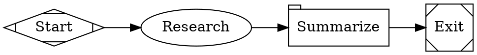

Fabro's [`web_search`](/agents/tools#web_search) tool lets agents search the web during workflow execution. It uses the [Brave Search API](https://brave.com/search/api/) to return titles, URLs, and descriptions for any query. Setting the API key is the only configuration needed — the tool is then registered for all provider profiles (Anthropic, OpenAI, Gemini). Without a key the tool is not registered at all, so agents are never offered a search tool they cannot use.

## Setup

1. Get a Brave Search API key from the [Brave Search API dashboard](https://brave.com/search/api/)

2. Store it on the Fabro server:

```bash
fabro secret set BRAVE_SEARCH_API_KEY BSA...
```

3. Verify the key is working:

```bash
fabro doctor
```

The doctor output should show **Brave Search** as "connected". If the key is missing, web search is reported as a warning — workflows still run, but the `web_search` tool is omitted from the agent's tool set and its system prompt, so agents fall back to other tools.

The Fabro server reads this key from the vault only. It does not read `BRAVE_SEARCH_API_KEY` from process env or `server.env`.

## How it works

Agents call the `web_search` tool with a query string. Fabro sends the query to the Brave Web Search API (`/res/v1/web/search`) and returns numbered results with title, URL, and description:

```
1. Rust Lang
   https://rust-lang.org
   A systems language

2. Rust Book
   https://doc.rust-lang.org/book
   The Rust book
```

If `BRAVE_SEARCH_API_KEY` is not configured in the vault, the tool returns an error explaining that the key is required. The agent can then fall back to other approaches.

See the [`web_search` tool reference](/agents/tools#web_search) for parameters and details.

## Permissions

`web_search` is classified as a `shell` category tool, requiring the `full` [permission level](/agents/permissions) for auto-approval. At lower permission levels:

- **Interactive mode** — the user is prompted to approve each call
- **Non-interactive mode** (`--auto-approve`) — calls are denied

## Example workflow

A workflow that researches a topic before writing about it:

<Frame>
  
</Frame>



## Troubleshooting

**"BRAVE_SEARCH_API_KEY is not configured"** — Add the key with `fabro secret set BRAVE_SEARCH_API_KEY <key>`. Run `fabro doctor` to verify.

**"Brave Search API returned status 401"** — The API key is invalid or expired. Generate a new key from the [Brave Search API dashboard](https://brave.com/search/api/).

**"Brave Search API returned status 429"** — Rate limit exceeded. The Brave Search free tier has usage limits. Upgrade your plan or reduce the frequency of `web_search` calls.

## Further reading

<Columns cols={2}>
  <Card title="Tools" icon="wrench" href="/agents/tools#web_search">
    Full `web_search` tool reference — parameters, output format, and error handling.
  </Card>
  <Card title="Permissions" icon="lock" href="/agents/permissions">
    How tool permissions control web search access.
  </Card>
</Columns>
