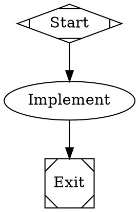

[DeepSeek](https://www.deepseek.com/) provides an OpenAI-compatible API for DeepSeek V4. Fabro includes direct access to V4 Flash and V4 Pro. The same Fabro model IDs also work through the optional Fireworks AI and OpenRouter providers.

## Prerequisites

- A [DeepSeek Platform](https://platform.deepseek.com/) account
- A DeepSeek API key from [platform.deepseek.com/api_keys](https://platform.deepseek.com/api_keys)
- A running Fabro server

## Configure direct access

The direct `deepseek` provider is enabled in the built-in catalog. Store its key in the target Fabro server vault:

```bash
fabro provider login --provider deepseek

# For a non-default remote server:
fabro provider login --server https://your-fabro.example --provider deepseek

# Or set the vault token directly:
fabro secret set DEEPSEEK_API_KEY
fabro secret --server https://your-fabro.example set DEEPSEEK_API_KEY
```

Standalone SDK usage outside a Fabro server can use an env-backed credential source explicitly:

```bash
export DEEPSEEK_API_KEY=<api-key>
```

Fabro sends bearer-authenticated Chat Completions requests to `https://api.deepseek.com`.

## Included models

| Fabro model ID | DeepSeek API model ID | Context | Max output | Role |
|---|---|---:|---:|---|
| `deepseek-v4-flash` | `deepseek-v4-flash` | 1,048,576 | 384,000 | Provider default, small default, and connectivity probe; aliases `deepseek`, `deepseek-v4`, `deepseek-flash` |
| `deepseek-v4-pro` | `deepseek-v4-pro` | 1,048,576 | 384,000 | Higher-capability V4 model |

Both models support text input, tool calling, native reasoning, streaming, JSON output, and automatic prompt caching. They do not support image input. Thinking mode is enabled by default.

## Agent profile

DeepSeek V4 uses Fabro's `openai` agent profile on every route. This profile is the closest match for DeepSeek's general coding behavior: it supplies project `AGENTS.md` instructions, standard JSON function tools, and a JSON-compatible file editor on Chat Completions routes. The setting is model-specific, so it remains the same through direct DeepSeek, Fireworks AI, and OpenRouter.

Fabro does not use the `gpt56` profile for DeepSeek. That profile has a smaller Codex-specific tool set for GPT-5.6 models.

## Use DeepSeek models

```bash
fabro model list --provider deepseek
fabro model test --provider deepseek --model deepseek-v4-flash --deep
fabro run workflow.fabro --provider deepseek --model deepseek
```

In workflow stylesheets:



## Thinking and reasoning effort

DeepSeek enables thinking by default at `high` effort. Fabro advertises only effort values that produce a distinct model behavior on each route:

| Route | V4 Flash | V4 Pro |
|---|---|---|
| Direct DeepSeek | `low`, `high`, `max` | `high`, `max` |
| Fireworks AI | `high`, `max` | `high`, `max` |
| OpenRouter | `low`, `high`, `max` | `high`, `xhigh` |

DeepSeek currently maps a V4 Pro request for `low` to `high`; its documentation says this mapping will change in early August 2026. Fireworks maps `low` and `medium` to `high`, and maps `xhigh` to `max`. OpenRouter names the Pro maximum tier `xhigh`.

Fabro omits `temperature` and `top_p` for these models because DeepSeek ignores sampling parameters while thinking is enabled.

To disable thinking on the direct provider, omit typed `reasoning_effort` and pass DeepSeek's native toggle through provider options:

```json
{
  "provider_options": {
    "deepseek": {
      "thinking": { "type": "disabled" }
    }
  }
}
```

DeepSeek requires `reasoning_content` from an assistant tool call to appear in every later request in that tool-use turn. Fabro captures this content and replays it with the assistant message. This keeps multi-step tool calls valid and prevents DeepSeek's HTTP 400 response for missing reasoning history.

## Prompt caching and pricing

DeepSeek applies prefix caching automatically. Fabro reads DeepSeek's `prompt_cache_hit_tokens` usage field and reports cache-read tokens separately from uncached input tokens.

The built-in catalog uses DeepSeek's published prices per million tokens:

| Model | Uncached input | Cache hit | Output |
|---|---:|---:|---:|
| `deepseek-v4-flash` | $0.14 | $0.0028 | $0.28 |
| `deepseek-v4-pro` | $0.435 | $0.003625 | $0.87 |

DeepSeek does not return an in-band dollar cost. Fabro calculates an estimated cost from these catalog rates and the reported token buckets.

## Use a gateway

The `deepseek-v4-flash`, `deepseek-v4-pro`, `deepseek`, `deepseek-v4`, and `deepseek-flash` selectors are portable across direct DeepSeek, Fireworks AI, and OpenRouter routes. Use `--provider` or a provider-qualified model selector when you need a specific route.

See the [Fireworks AI integration](/integrations/fireworks) and [OpenRouter integration](/integrations/openrouter) for gateway setup and provider-specific pricing.

## Troubleshooting

**"No API key configured"** — Store `DEEPSEEK_API_KEY` on the target server with `fabro provider login --provider deepseek`. The server runtime resolves the key from its vault, not from process env.

**Unknown model** — Use `deepseek-v4-flash` or `deepseek-v4-pro`. The retired `deepseek-chat` and `deepseek-reasoner` API IDs are not in the Fabro catalog.

**A tool continuation returns HTTP 400** — Keep the assistant thinking content in conversation history. Fabro does this automatically when it replays tool-call turns.

## Further reading

<Columns cols={3}>
  <Card title="DeepSeek API" icon="code" href="https://api-docs.deepseek.com/">
    Official authentication, endpoints, and API reference.
  </Card>
  <Card title="Models and pricing" icon="money-bill" href="https://api-docs.deepseek.com/quick_start/pricing/">
    Official limits, features, and token prices.
  </Card>
  <Card title="Thinking mode" icon="brain" href="https://api-docs.deepseek.com/guides/thinking_mode/">
    Official thinking toggles, effort mappings, and tool-call replay rules.
  </Card>
</Columns>
