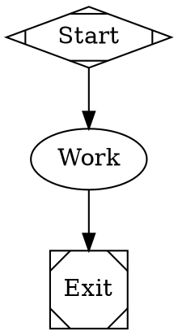

[Fireworks AI](https://fireworks.ai/) serves open-weights models (Kimi, DeepSeek, GLM, Qwen, GPT-OSS, and more) behind an OpenAI-compatible API. Fabro ships a disabled `fireworks` provider entry with a curated model catalog, so you can opt in from `settings.toml` without changing Fabro code.

## Prerequisites

- A [Fireworks AI account](https://fireworks.ai/) with serverless credit
- An API key from [app.fireworks.ai/settings/users/api-keys](https://app.fireworks.ai/settings/users/api-keys)

## Enable the provider

Fabro runs execute through a Fabro server. Add the provider override to the settings file used by that server. For a local server, this is usually `~/.fabro/settings.toml`; for a remote deployment, update the server host's Fabro settings.

```toml title="settings.toml"
_version = 1

[llm.providers.fireworks]
enabled = true
```

## Configure credentials

Store the key in the target Fabro server vault:

```bash
fabro provider login --provider fireworks

# For a non-default remote server:
fabro provider login --server https://your-fabro.example --provider fireworks

# Or set the vault token directly:
fabro secret set FIREWORKS_API_KEY fw_...
fabro secret --server https://your-fabro.example set FIREWORKS_API_KEY fw_...
```

Direct SDK usage outside a Fabro server can use an env-backed credential source explicitly:

```bash
export FIREWORKS_API_KEY=fw_...
```

## Included models

The built-in catalog gives Fireworks offerings the same human-facing model slugs used by other providers. Fireworks account-scoped model paths remain opaque `api_id` values:

| Fabro model slug | Fireworks API ID / notes |
| --- | --- |
| `kimi-k2.7-code` | `accounts/fireworks/models/kimi-k2p7-code`; provider default |
| `kimi-k2.6` | `accounts/fireworks/models/kimi-k2p6` |
| `deepseek-v4-pro`, `deepseek-v4-flash` (`deepseek`, `deepseek-v4`, `deepseek-flash`) | `accounts/fireworks/models/deepseek-v4-...` |
| `glm-5.2` | `accounts/fireworks/models/glm-5p2` |
| `minimax-m2.7` | `accounts/fireworks/models/minimax-m2p7` |
| `qwen3.7-plus` | `accounts/fireworks/models/qwen3p7-plus` |
| `gpt-oss-120b` | `accounts/fireworks/models/gpt-oss-120b` |
| `gpt-oss-20b` | `accounts/fireworks/models/gpt-oss-20b`; provider small default |

Any other Fireworks serverless model can be added under the provider. Choose a stable Fabro model slug as the table key and put the Fireworks account-scoped path in `api_id` (dots in upstream model names become `p`, e.g. `glm-5.2` → `glm-5p2`):

```toml title="settings.toml"
[llm.providers.fireworks.models."llama-4-maverick"]
api_id = "accounts/fireworks/models/llama4-maverick-instruct-basic"
display_name = "Llama 4 Maverick"
family = "llama-4"

[llm.providers.fireworks.models."llama-4-maverick".limits]
context_window = 1000000

[llm.providers.fireworks.models."llama-4-maverick".features]
tools = true
vision = false
reasoning = false
```

Note that Fireworks' `GET /v1/models` endpoint only returns a featured subset of serverless models; a model absent from that list may still be servable. Verify custom additions with `fabro model test`.

## Use Fireworks models

```bash
fabro model list --provider fireworks
fabro model test --provider fireworks --model kimi-k2.7-code
fabro run workflow.fabro --provider fireworks --model deepseek-v4-flash
```

When targeting a non-default remote server, pass the same `--server` value to verification commands:

```bash
fabro model list --server https://your-fabro.example --provider fireworks
fabro model test --server https://your-fabro.example --provider fireworks --model kimi-k2.7-code
```

In workflow stylesheets:



## Prompt caching

Fireworks caches prompt prefixes automatically — no cache breakpoints or request changes are needed. Serverless responses report cached tokens in the usage body, and cached input tokens are billed at a per-model discount (typically 50% or better). Fabro reads the cached-token counts and applies the catalog's `cache_input_cost_per_mtok` rates when estimating costs.

## Costs

Catalog prices mirror [Fireworks serverless pricing](https://docs.fireworks.ai/serverless/pricing) (standard tier). Fireworks does not return in-band billing, so Fabro reports `cost_source = "estimated"` from catalog rates. Fireworks' "Fast" model variants and Priority service tier are not included in the built-in catalog.

## Troubleshooting

**"No API key configured"** — Set the key on the target server with `fabro provider login --provider fireworks` or `fabro secret set FIREWORKS_API_KEY ...`. For direct SDK usage outside a Fabro server, export `FIREWORKS_API_KEY` in the invoking shell.

**"provider 'fireworks' is not configured in the server model catalog"** — Confirm the server host's `settings.toml` has `[llm.providers.fireworks]` with `enabled = true`. Fabro live-reloads `settings.toml` within a few seconds; after that, `fabro model list --provider fireworks` against the same server should show the enabled catalog.

**402 / insufficient credits** — Serverless inference requires prepaid credit; check your balance in the [Fireworks billing dashboard](https://app.fireworks.ai/settings/billing).

**Unknown model** — Confirm the model's `api_id` matches a Fireworks account-scoped path exactly (`accounts/fireworks/models/...`), then run `fabro model test --model <fabro-model-id>`. Remember that `GET /v1/models` only lists a featured subset, so absence from that list is not conclusive.

## Further reading

<Columns cols={2}>
  <Card title="Models" icon="microchip" href="/core-concepts/models">
    How Fabro routes model IDs, providers, and fallbacks.
  </Card>
  <Card title="Settings Configuration" icon="gear" href="/reference/user-configuration">
    Full reference for provider settings and provider-scoped model offerings.
  </Card>
</Columns>
