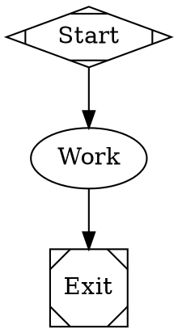

[OpenRouter](https://openrouter.ai/) is an aggregator that fronts hundreds of models behind one OpenAI-compatible API. Fabro ships a disabled `openrouter` provider entry with a curated model catalog, so you can opt in from `settings.toml` without changing Fabro code.

## Prerequisites

- An [OpenRouter account](https://openrouter.ai/) with credit for paid models
- An API key from [openrouter.ai/keys](https://openrouter.ai/keys)

## Enable the provider

Fabro runs execute through a Fabro server. Add the provider override to the settings file used by that server. For a local server, this is usually `~/.fabro/settings.toml`; for a remote deployment, update the server host's Fabro settings.

```toml title="settings.toml"
_version = 1

[llm.providers.openrouter]
enabled = true
```

## Configure credentials

Store the key in the target Fabro server vault:

```bash
fabro provider login --provider openrouter

# For a non-default remote server:
fabro provider login --server https://your-fabro.example --provider openrouter

# Or set the vault token directly:
fabro secret set OPENROUTER_API_KEY sk-or-v1-...
fabro secret --server https://your-fabro.example set OPENROUTER_API_KEY sk-or-v1-...
```

Direct SDK usage outside a Fabro server can use an env-backed credential source explicitly:

```bash
export OPENROUTER_API_KEY=sk-or-v1-...
```

## Included models

The built-in catalog gives OpenRouter offerings the same human-facing model slugs used by direct providers. Vendor-namespaced OpenRouter IDs remain opaque `api_id` values:

| Fabro model slug | OpenRouter API ID / notes |
| --- | --- |
| `claude-fable-5`, `claude-opus-5`, `claude-opus-4-8`, `claude-opus-4-7` | Matching `anthropic/...` API IDs; Anthropic-style cache billing |
| `claude-sonnet-4-6` | `anthropic/claude-sonnet-4.6`; provider default |
| `claude-haiku-4-5` | `anthropic/claude-haiku-4.5`; provider small default |
| `gpt-5.6-sol`, `gpt-5.6-terra`, `gpt-5.6-luna`, `gpt-5.4`, `gpt-5.5` | Matching `openai/...` API IDs |
| `gemini-3.1-pro-preview`, `gemini-3.5-flash` | `google/...` API IDs |
| `deepseek-v4-pro`, `deepseek-v4-flash` (`deepseek`, `deepseek-v4`, `deepseek-flash`) | `deepseek/...` API IDs; Flash uses the `deepseek-v4-flash-0731` release |
| `kimi-k3`, `kimi-k2.6`, `qwen3-coder`, `qwen3.6-flash` | Vendor-prefixed API IDs |
| `laguna-s-2.1`, `laguna-xs-2.1` | `poolside/...`; native reasoning and tool use |
| `glm-5.2` (`glm`, `glm5`, `glm52`, `glm5.2`), `glm-4.6` | `z-ai/...` API IDs |
| `minimax-m2.7`, `mimo-v2.5-pro` | Vendor-prefixed API IDs |
| `nemotron-3-super-120b-a12b`, `devstral-2512` | Vendor-prefixed API IDs |

Any other OpenRouter model can be added under the provider. Choose a stable Fabro model slug as the table key and put OpenRouter's exact vendor/model string in `api_id`:

```toml title="settings.toml"
[llm.providers.openrouter.models."llama-4-maverick"]
api_id = "meta-llama/llama-4-maverick"
display_name = "Llama 4 Maverick"
family = "llama-4"

[llm.providers.openrouter.models."llama-4-maverick".limits]
context_window = 1000000

[llm.providers.openrouter.models."llama-4-maverick".features]
tools = true
vision = false
reasoning = false
```

## Use OpenRouter models

```bash
fabro model list --provider openrouter
fabro model test --provider openrouter --model claude-sonnet-4-6
fabro run workflow.fabro --provider openrouter --model deepseek-v4-flash
```

When targeting a non-default remote server, pass the same `--server` value to verification commands:

```bash
fabro model list --server https://your-fabro.example --provider openrouter
fabro model test --server https://your-fabro.example --model anthropic/claude-sonnet-4-6
```

In workflow stylesheets:



## Cost telemetry

Every OpenRouter response includes an inline `usage.cost` with authoritative USD billing. Fabro surfaces it as `cost_usd` with `cost_source = "authoritative"` on completion responses. Other providers populate the same fields from catalog price estimates with `cost_source = "estimated"`.

The catalog prices on OpenRouter model rows are best-effort estimates used only before the authoritative figure arrives (for example, mid-stream rollups).

## Provider routing

OpenRouter's [provider routing preferences](https://openrouter.ai/docs/guides/routing/provider-selection) pass through verbatim via `provider_options.openrouter` on API/SDK requests — the keys merge into the top level of the request body:

```json
{
  "model": "anthropic/claude-sonnet-4-6",
  "provider_options": {
    "openrouter": {
      "provider": { "sort": "throughput", "data_collection": "deny" },
      "models": ["anthropic/claude-sonnet-4.6", "deepseek/deepseek-v4-pro"]
    }
  }
}
```

## Attribution headers

Fabro does not send OpenRouter's optional attribution headers (`HTTP-Referer`, `X-Title`) by default, so self-hosted installations stay anonymous on OpenRouter's public app leaderboard. Workflow runs do send `x-session-id: <run-id>` for request grouping; an explicit provider `extra_headers` value for that header takes precedence. To opt in to attribution:

```toml title="settings.toml"
[llm.providers.openrouter.extra_headers]
"HTTP-Referer" = "https://your-site.example"
"X-Title" = "Your App"
```

## Troubleshooting

**"No API key configured"** — Set the key on the target server with `fabro provider login --provider openrouter` or `fabro secret set OPENROUTER_API_KEY ...`. For direct SDK usage outside a Fabro server, export `OPENROUTER_API_KEY` in the invoking shell.

**"provider 'openrouter' is not configured in the server model catalog"** — Confirm the server host's `settings.toml` has `[llm.providers.openrouter]` with `enabled = true`. Fabro live-reloads `settings.toml` within a few seconds; after that, `fabro model list --provider openrouter` against the same server should show the enabled catalog.

**402 / insufficient credits** — Paid OpenRouter models require prepaid credit; check your balance at [openrouter.ai/credits](https://openrouter.ai/credits).

**Unknown model** — Confirm the model's `api_id` matches an OpenRouter slug exactly (including the vendor prefix), then run `fabro model test --model <fabro-model-id>`.

## Further reading

<Columns cols={2}>
  <Card title="Models" icon="microchip" href="/core-concepts/models">
    How Fabro routes model IDs, providers, and fallbacks.
  </Card>
  <Card title="Settings Configuration" icon="gear" href="/reference/user-configuration">
    Full reference for provider settings and provider-scoped model offerings.
  </Card>
</Columns>
