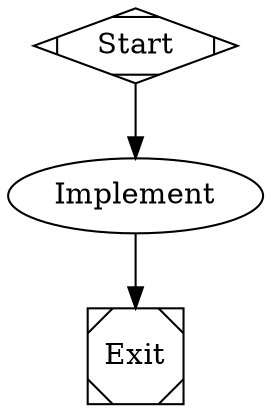

[Poolside](https://poolside.ai/) trains the Laguna family of agentic coding models. Fabro includes Poolside's OpenAI-compatible API as a built-in provider, with Laguna S 2.1 and Laguna XS 2.1 available through both Poolside directly and the opt-in [OpenRouter integration](/integrations/openrouter).

## Prerequisites

- A Poolside developer API key from [platform.poolside.ai](https://platform.poolside.ai/)
- A running Fabro server

Poolside Platform currently offers free developer access for a limited time. The built-in catalog records Poolside's published paid endpoint prices so Fabro can produce durable estimated cost telemetry when the preview ends or an account uses paid access.

## Configure direct access

The direct `poolside` provider is enabled in the built-in catalog. Store its key in the target Fabro server vault:

```bash
fabro provider login --provider poolside

# For a non-default remote server:
fabro provider login --server https://your-fabro.example --provider poolside

# Or set the vault token directly:
fabro secret set POOLSIDE_API_KEY
fabro secret --server https://your-fabro.example set POOLSIDE_API_KEY
```

Standalone SDK usage outside a Fabro server can use an env-backed credential source explicitly:

```bash
export POOLSIDE_API_KEY=<api-key>
```

The provider sends OpenAI-compatible Chat Completions requests to `https://inference.poolside.ai/v1` using bearer authentication.

## Included models

| Fabro model ID | Poolside API model ID | Context | Max output | Role |
|---|---|---:|---:|---|
| `laguna-s-2.1` | `poolside/laguna-s-2.1` | 1,048,576 | 131,072 | Provider default; aliases `laguna`, `laguna-s` |
| `laguna-xs-2.1` | `poolside/laguna-xs-2.1` | 262,144 | 32,768 | Small default and connectivity probe; alias `laguna-xs` |

Both models support text input, tool calling, native reasoning, streaming, and automatic prompt-cache usage reporting. They do not support image input.

## Use direct Poolside models

```bash
fabro model list --provider poolside
fabro model test --model laguna-xs-2.1 --deep
fabro run workflow.fabro --model laguna-s-2.1
```

In workflow stylesheets:



## Reasoning behavior

Laguna S 2.1 and XS 2.1 support two thinking modes: off and max. Max thinking is enabled by default. These releases do not expose low, medium, or high reasoning-effort levels, so Fabro intentionally does not advertise typed `reasoning_effort` controls for them.

Fabro preserves Poolside's `reasoning_content` between assistant and tool messages. This is important for interleaved thinking across multi-step tool calls.

For direct API or SDK requests, disable thinking through `provider_options.poolside`:

```json
{
  "model": "laguna-s-2.1",
  "provider_options": {
    "poolside": {
      "chat_template_kwargs": {
        "enable_thinking": false
      }
    }
  }
}
```

## Use Laguna through OpenRouter

Enable OpenRouter and configure its separate API key as described in the [OpenRouter integration](/integrations/openrouter):

```toml title="settings.toml"
[llm.providers.openrouter]
enabled = true
```

The OpenRouter routes use vendor-namespaced model IDs so they can coexist with direct Poolside routes:

```bash
fabro model test --model poolside/laguna-xs-2.1 --deep
fabro run workflow.fabro --model poolside/laguna-s-2.1
```

OpenRouter returns authoritative in-band cost telemetry. Its current paid rates per million input, output, and cache-read tokens are:

| Model | Input | Output | Cache read |
|---|---:|---:|---:|
| `poolside/laguna-s-2.1` | $0.10 | $0.20 | $0.01 |
| `poolside/laguna-xs-2.1` | $0.06 | $0.12 | $0.03 |

The XS rate reflects OpenRouter's current promotional discount and can change. Fabro prefers OpenRouter's authoritative `usage.cost` over catalog estimates.

Fabro does not include promotional `:free` OpenRouter variants in the built-in catalog because their availability and limits can change. Add one as a custom model if you explicitly want that route.

## Troubleshooting

**"No API key configured"** — Store `POOLSIDE_API_KEY` on the target server with `fabro provider login --provider poolside`. The server runtime resolves the key from its vault, not from process env.

**Unknown model** — Direct Poolside routes use `laguna-s-2.1` and `laguna-xs-2.1`. OpenRouter routes include the `poolside/` prefix.

**Reasoning effort rejected** — Laguna's hosted endpoints support thinking off or max, not low/medium/high effort. Omit `reasoning_effort`; use the provider option above only when you need to disable thinking.

## Further reading

<Columns cols={2}>
  <Card title="Poolside API" icon="code" href="https://docs.poolside.ai/api/overview">
    Official API endpoints, authentication, model listing, and tool-use examples.
  </Card>
  <Card title="Laguna models" icon="microchip" href="https://poolside.ai/models">
    Current model capabilities, weights, context windows, and release information.
  </Card>
</Columns>
