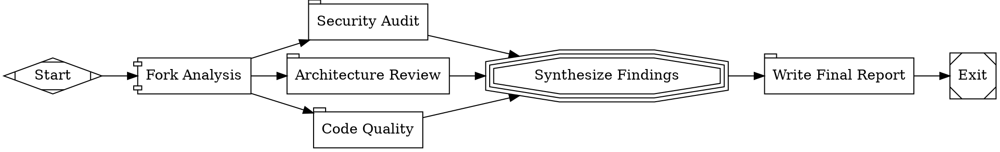

This tutorial runs three code review perspectives in parallel — security, architecture, and quality — then merges the results into a single report.

## The workflow

<Frame>
  
</Frame>



```bash
fabro run docs/internal/demo/06-parallel.fabro
```

## Fan-out with the fork node

The `fork` node has `shape=component`, making it a **parallel fan-out node**. Every outgoing edge becomes a concurrent branch:

```dot
fork [label="Fork Analysis", shape=component]

fork -> security
fork -> architecture
fork -> quality
```

All three branches start concurrently and operate in the same sandbox checkout and working directory. This review is safe because the branches are prompt nodes with no workspace tools.

<Warning>
Parallel branches are not isolated from one another. If branches edit files, they can observe, race with, or overwrite each other's changes. Fabro does not lock files, detect overlapping writes, or warn about races. Keep branches read-only or give each branch responsibility for disjoint paths.
</Warning>

The parallel node always waits for every branch to finish before continuing.

## Fan-in with the merge node

The `merge` node has `shape=tripleoctagon`, making it a **merge (fan-in) node**. It receives every branch's status and context updates in `parallel.results` and synthesizes them with its prompt:

```dot
merge [
    label="Synthesize Findings",
    shape=tripleoctagon,
    prompt="Synthesize every branch result into a prioritized summary report with the top 5 action items."
]

security     -> merge
architecture -> merge
quality      -> merge
```

`parallel.results` is runtime context, not a `parallel_results.json` file in the checkout. Fan-in never selects a branch's files or changes workspace state; every branch has already worked in the same checkout. The downstream `report` node writes the synthesis produced by fan-in as the final report.

## Concurrency control

By default, Fabro runs up to 4 parallel branches simultaneously. Control this with `max_parallel`:

```dot
fork [shape=component, max_parallel=2]
```

This is useful when branches are resource-intensive (e.g., each running a full agent session with tool calls) and you want to limit concurrency.

## What you've learned

- **Fan-out nodes** (`shape=component`) spawn concurrent branches and wait for all of them
- Parallel branches share one checkout, so workflows must prevent or tolerate file races
- **Fan-in nodes** (`shape=tripleoctagon`) can synthesize `parallel.results` with a prompt
- Fan-in never selects or restores workspace state, and no results file is created

## Next

<Card title="Multi-Model Routing" icon="arrow-right" href="/tutorials/multi-model">
  Assign different models to different workflow nodes using stylesheets.
</Card>
